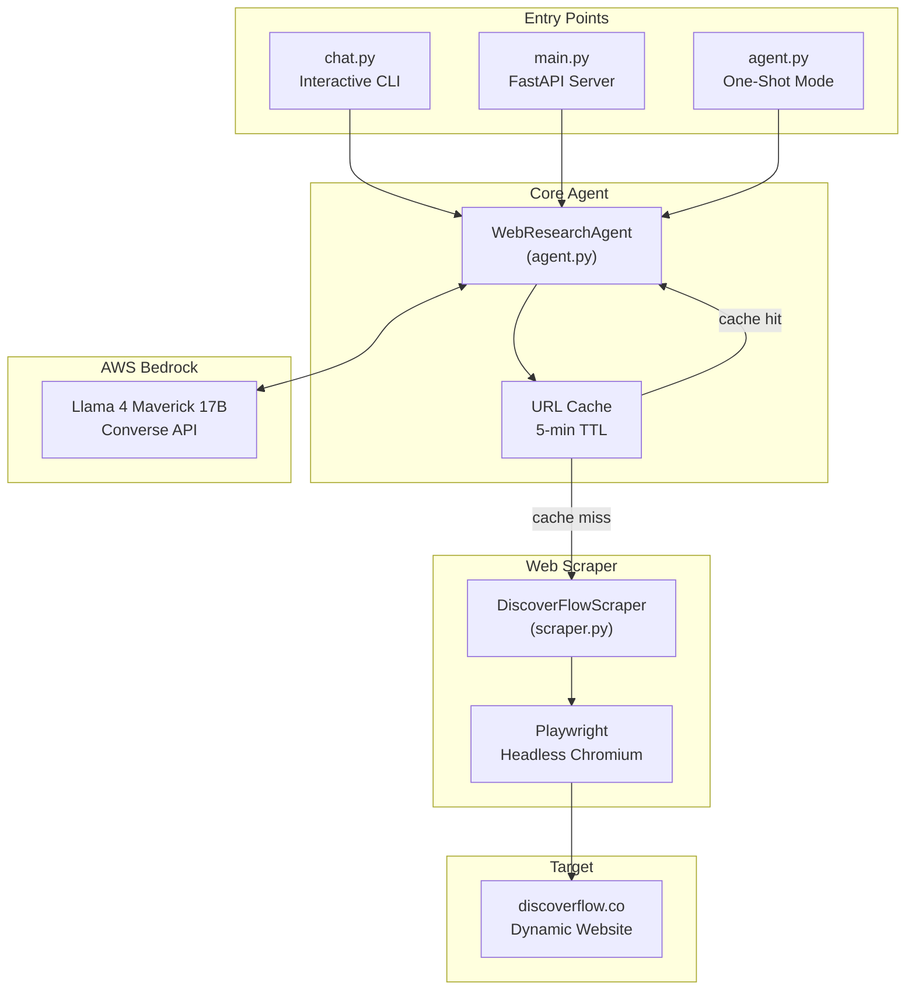
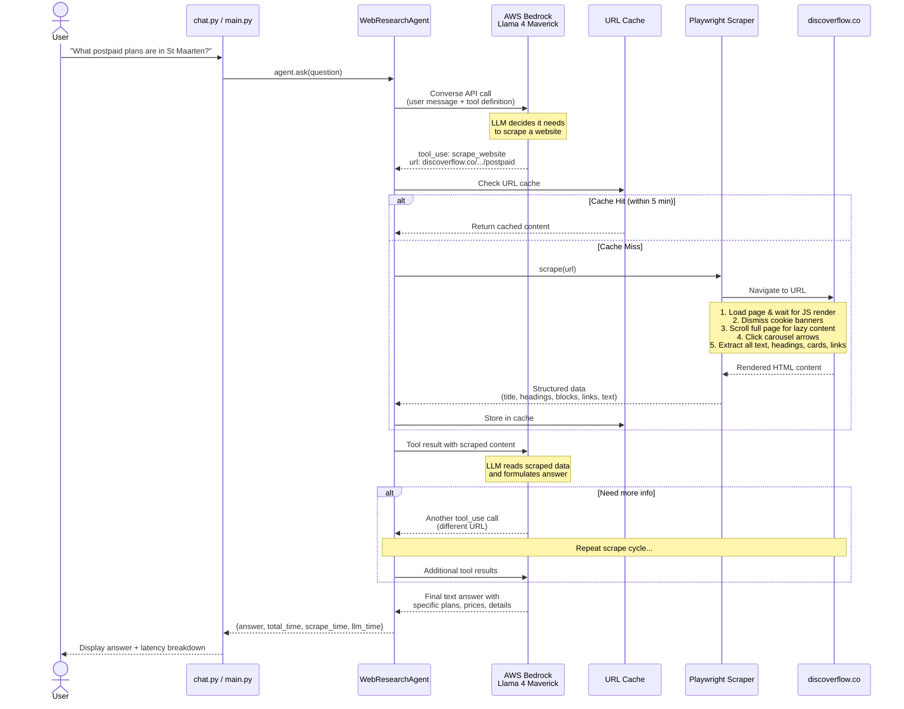
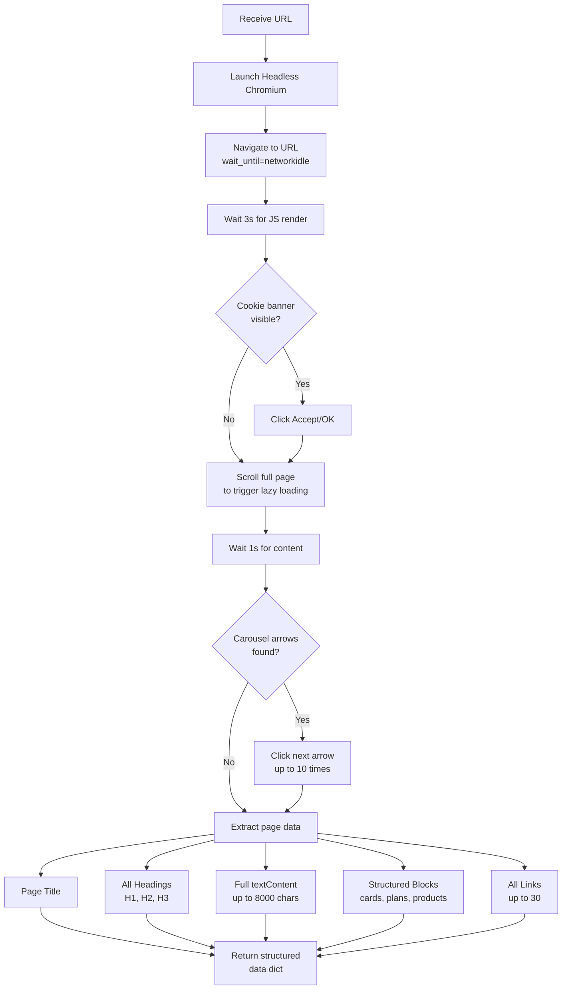
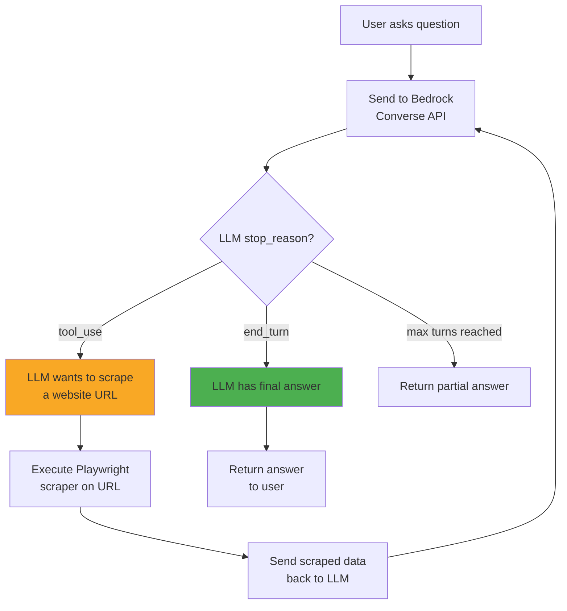

# DiscOverflow AI Web Research Agent

An AI-powered web research agent that scrapes dynamic, JavaScript-rendered content from [discoverflow.co](https://discoverflow.co/) in real-time using a **Playwright headless browser** and answers questions using **AWS Bedrock Llama 4 Maverick** (`meta.llama4-maverick-17b-instruct-v1:0`).

---

## Features

- **Real-Time Dynamic Scraping** -- Playwright headless browser renders JavaScript-heavy pages and extracts all content
- **AI-Powered Analysis** -- Llama 4 Maverick on AWS Bedrock analyzes scraped content and provides detailed answers
- **Interactive Chat Mode** -- Multi-turn conversational interface with context memory
- **REST API Server** -- FastAPI endpoints for programmatic access (ready for TTS, web UI, etc.)
- **Native Tool Calling** -- AWS Bedrock Converse API with native tool use for automatic scraper invocation
- **URL Caching** -- Avoids re-scraping the same page within 5 minutes
- **Latency Tracking** -- Per-question breakdown of scraping vs LLM inference time

---

## Architecture Overview



---

## Detailed Agent Flow

This is the complete flow from when a user asks a question to when they receive an answer:



---

## Scraper Detail Flow

What happens inside the Playwright scraper when it visits a page:



---

## Tool Calling Flow

How the LLM decides when to use the scraper tool:



---

## Project Structure

```
swp/
  agent.py          # WebResearchAgent class (core logic)
                    #   - Bedrock Converse API integration
                    #   - Tool call handling
                    #   - URL caching
                    #   - Scraper output formatting
                    #   - Also runs as one-shot CLI

  chat.py           # Interactive chat CLI
                    #   - Imports WebResearchAgent from agent.py
                    #   - Multi-turn conversation loop
                    #   - Latency display

  main.py           # FastAPI REST API server
                    #   - POST /ask     (stateless question)
                    #   - POST /chat    (session-based chat)
                    #   - POST /scrape  (direct URL scraping)
                    #   - GET  /health  (health check)

  scraper.py        # Playwright headless browser scraper
                    #   - Cookie banner dismissal
                    #   - Full page scrolling
                    #   - Carousel navigation
                    #   - Structured content extraction

  requirements.txt  # Python dependencies
  .gitignore        # Git ignore rules
```

---

## API Endpoints (main.py)

| Method | Endpoint | Description |
|--------|----------|-------------|
| `GET` | `/health` | Health check, returns model info |
| `POST` | `/ask` | One-shot question (no memory) |
| `POST` | `/chat` | Chat with session memory |
| `POST` | `/chat/{id}/reset` | Reset a chat session |
| `POST` | `/scrape` | Scrape a URL directly |

**Example request:**
```bash
curl -X POST http://localhost:8000/ask \
  -H "Content-Type: application/json" \
  -d '{"question": "What postpaid plans are in St Maarten?"}'
```

**Example response:**
```json
{
  "answer": "The postpaid plans in St. Maarten are:\n- $15/month: 2GB, 50 min, 20 msg\n...",
  "total_time": 18.5,
  "scrape_time": 15.2,
  "llm_time": 3.3
}
```

---

## Local Setup

### Prerequisites

- **Python 3.10+**
- **AWS Account** with Bedrock access for Meta Llama 4 Maverick
- **AWS CLI** configured (`aws configure`)

### Installation

```bash
# Clone the repository
git clone https://github.com/giridharpalla/web-scrapping-crewai-bedrock.git
cd web-scrapping-crewai-bedrock

# Create virtual environment
python -m venv venv

# Activate (Windows)
.\venv\Scripts\Activate.ps1

# Activate (macOS/Linux)
source venv/bin/activate

# Install dependencies
pip install -r requirements.txt

# Install Playwright browsers
playwright install chromium

# Configure AWS (if not done)
aws configure
```

### AWS Bedrock Model Access

1. Go to AWS Console > Amazon Bedrock > Model Access
2. Request access for **Meta Llama 4 Maverick 17B Instruct**
3. Ensure region is set to **us-east-1**

---

## Running

### Interactive Chat
```bash
python chat.py
```

### One-Shot Agent
```bash
python agent.py
```

### REST API Server
```bash
uvicorn main:app --reload --port 8000
# Then visit http://localhost:8000/docs for Swagger UI
```

---

## Example Chat Session

```
============================================================
  DiscOverflow Chat - Powered by Llama 4 Maverick
  Ask me anything about discoverflow.co!
  Type 'quit' or 'exit' to stop.
============================================================

You: what postpaid plans are in st maarten?
  [Scraping https://discoverflow.co/en/web/st-maarten/mobile/plans/postpaid...]
  [Done - 11835 chars]

A: The postpaid plans available in St. Maarten are:

  * $15/month: 2GB data, 50 minutes, 20 messages
  * $25/month: 3GB data, 70 minutes, 50 messages
  * $35/month: 3.5GB data, 100 minutes, 100 messages
  * $55/month: 5GB data, 160 minutes, 150 messages
  * $80/month: 7GB data, 240 minutes, 200 messages
  * $100/month: 9GB data, 350 minutes, 200 messages
  * $135/month: 12GB data, 400 minutes, 200 messages
  * $249/month: 20GB data, 1000 minutes, 200 messages

  Add-ons available via SMS to 5454:
  * Data: 1.5GB/$5, 3GB/$8, 6GB/$14
  * Minutes & Messages: 60min+30msg/$12, 160min+40msg/$29, 300min+50msg/$55

  [Latency: total=18.5s | scraping=15.2s | LLM=3.3s]
```

---

## Latency Breakdown

| Component | Typical Time | Notes |
|-----------|-------------|-------|
| Playwright page load | 5-8s | Depends on target site speed |
| JS render wait | 3s | Allows dynamic content to load |
| Page scroll + carousel | 2-4s | Triggers lazy-loaded content |
| Content extraction | <0.5s | DOM parsing |
| LLM inference | 2-4s | Bedrock Converse API |
| **Cache hit** | **<0.1s** | Same URL within 5 minutes |

---

## Tech Stack

| Component | Technology |
|-----------|-----------|
| LLM | AWS Bedrock - Meta Llama 4 Maverick 17B |
| Web Scraping | Playwright (headless Chromium) |
| API Framework | FastAPI + Uvicorn |
| AWS SDK | boto3 |
| Language | Python 3.10+ |
